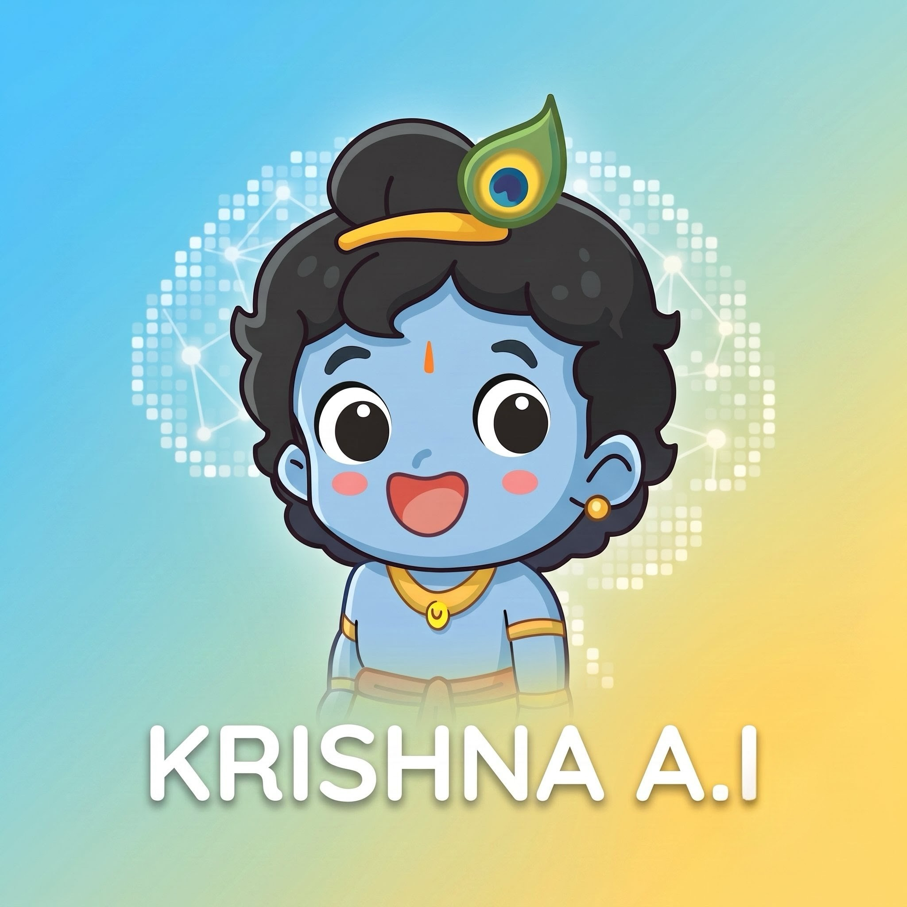

<p align="center">
  
</p>

<h1 align="center">Chibi Krishna AI</h1>

<p align="center">
  A cheerful AI Krishna companion that shares Gita wisdom in Hindi and English, by voice or text.
</p>

<p align="center">
  <a href="https://play.google.com/store/apps/details?id=com.chibikrishna.chibi_krishna"></a>
  
  
  
</p>

---

## What it does

- **Talk to Krishna**: ask a question by voice (Hindi-first speech recognition) or text, and a chibi Krishna answers aloud in your language with Gita-themed guidance.
- **A living character**: a full-screen 2D Rive rig that idles, listens and speaks, using Rive Data Binding to drive pose, emotion and eyes.
- **Always answers**: replies come from Gemini via Firebase AI Logic. On a timeout or error, the app falls back to a curated local library of Gita quotes.
- **Safety first**: an on-device classifier spots crisis or self-harm language in English, Hindi and Hinglish, and shows a persistent helpline strip.
- **Fair free tier**: 10 voice turns a day, stored on the device. Watching an optional rewarded ad unlocks 5 more.

## Tech stack

| Area | Choice |
|---|---|
| App | Flutter, `flutter_bloc` (Cubit) |
| Character | Rive `0.14.x` with Data Binding |
| AI | Firebase AI Logic (Gemini) with App Check, so no API key ships in the app |
| Voice | `speech_to_text`, `flutter_tts`, `just_audio` for background flute |
| Storage | `sqflite`, `shared_preferences`; there is no custom backend |
| Monetisation | AdMob (banner and rewarded) with UMP consent |
| Release | GitHub Actions workflow that publishes to a Play Console track (manual trigger only) |

## Project structure

```
lib/
├── core/services/          # audio, Gemini
└── features/
    ├── stage/              # Rive character view + state
    ├── oracle/             # conversation flow, speech-to-text, TTS, quotes
    ├── safety/             # crisis classifier, helplines, crisis strip
    ├── monetization/       # quota, ads, consent, support sheet
    └── about/              # disclaimer, attribution, privacy policy
assets/
├── rive/                   # chibi_krishna.riv
├── gita/                   # local quote library
└── audio/                  # background flute loop
docs/                       # PRDs, design findings, legal
```

## Getting started

```bash
flutter pub get
# one-time setup so widget tests can load the Rive native library
dart run rive_native:setup --platform macos
flutter run
```

You also need a Firebase project. Configure it with `flutterfire configure`, which generates `lib/firebase_options.dart`. Android is the release target; iOS is only used for local development.

## Docs

- Product spec: [`docs/Chibi_Krishna_AI_PRD_v3.md`](docs/Chibi_Krishna_AI_PRD_v3.md) (v1 and v2 are historical)
- Design decisions: [`docs/Chibi_Krishna_AI_Design_Findings.md`](docs/Chibi_Krishna_AI_Design_Findings.md)
- [Privacy policy](https://vageshwar.github.io/chibi-krishna/legal/privacy-policy.html)

## Credits

The Krishna character is the **KrishnaJI** Rive asset by **ar.akash**, used under [CC BY 4.0](https://creativecommons.org/licenses/by/4.0/).

> Chibi Krishna AI is an AI avatar inspired by Krishna. It is not a guru, doctor or counsellor, and it does not replace any of them.
